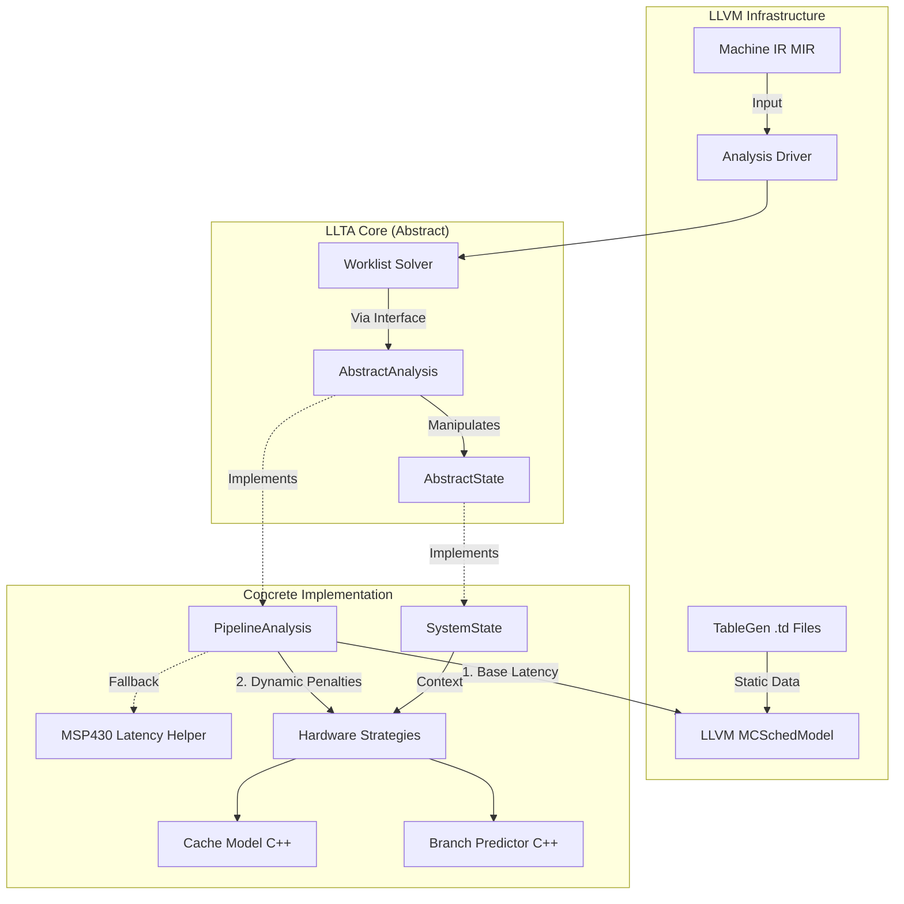

This is a comprehensive architectural blueprint for the **Hybrid LLTA Analysis Engine**. This design balances the robustness of LLVM's existing backend data with the flexibility required for research-grade WCET analysis.

### 1. The Architecture Diagram

This diagram visualizes the separation between the **Solver** (the engine), the **LLVM Backend** (the static physics), and the **LLTA Plugins** (the dynamic logic).



**Key Data Flow:**

1.  The **Solver** pushes the `AbstractState` through the Control Flow Graph.
2.  The **PipelineAnalysis** (concrete) encounters a `MachineInstr`.
3.  It asks **LLVM SchedModel**: "How long does this take purely based on operands and hazards?" (e.g., 3 cycles).
4.  It asks **Cache Model**: "Is `0x1004` a Hit or Miss?" (e.g., Miss = +10 cycles).
5.  It updates the `SystemState` (concrete) with the total time (13 cycles) and the new cache state.

-----

### 2. Implementation Overview

We will implement this in **four distinct modules** to ensure modularity.

1.  **`LLTASolver`**: A generic, non-templated (or lightly templated) fixpoint engine.
2.  **`LLTAState`**: The container for the analysis results (pipeline resources, cache tags, clock cycle).
3.  **`LLTAStrategies`**: The abstract base classes for Cache, Branch Prediction, and Memory Controllers.
4.  **`LLTADomain`**: The coordinator that ties MIR, Strategies, and State together.

-----

### 3. The Header Files

Here are the concrete contracts your team needs to implement.

#### A. `include/llta/Analysis/AbstractState.h`

*Abstract base class for analysis states (Lattice elements).*

```cpp
#ifndef LLTA_ANALYSIS_ABSTRACTSTATE_H
#define LLTA_ANALYSIS_ABSTRACTSTATE_H

#include "llvm/Support/raw_ostream.h"
#include <memory>

namespace llta {

/// Abstract base class representing the state of the system at a program point.
class AbstractState {
public:
  virtual ~AbstractState() = default;

  /// Returns true if this state is equal to Other.
  virtual bool equals(const AbstractState &Other) const = 0;

  /// Prints the state for debugging purposes.
  virtual void print(llvm::raw_ostream &OS) const = 0;

  /// Creates a deep copy of this state.
  virtual std::unique_ptr<AbstractState> clone() const = 0;
};

} // namespace llta

#endif // LLTA_ANALYSIS_ABSTRACTSTATE_H
```

#### B. `include/llta/Analysis/AbstractAnalysis.h`

*Abstract base class for defining the analysis logic (Transfer functions & Join).*

```cpp
#ifndef LLTA_ANALYSIS_ABSTRACTANALYSIS_H
#define LLTA_ANALYSIS_ABSTRACTANALYSIS_H

#include "llta/Analysis/AbstractState.h"
#include "llvm/CodeGen/MachineInstr.h"
#include <memory>

namespace llta {

/// Abstract interface for the analysis logic.
class AbstractAnalysis {
public:
  virtual ~AbstractAnalysis() = default;

  /// The Transfer function: State_Out = f(State_In, Instruction).
  /// Returns a new state representing the effect of executing MI on FromState.
  virtual std::unique_ptr<AbstractState> 
  transfer(const AbstractState &FromState, const llvm::MachineInstr &MI) = 0;

  /// The Join operator: Merges two states (e.g., control flow checks).
  /// Returns a new state representing the union/merge of S1 and S2.
  virtual std::unique_ptr<AbstractState> 
  join(const AbstractState &S1, const AbstractState &S2) = 0;

  /// Returns the initial state for the analysis entry point.
  virtual std::unique_ptr<AbstractState> getInitialState() = 0;

  /// Checks if S1 <= S2 (lattice partial order) for fixpoint convergence.
  virtual bool isLessOrEqual(const AbstractState &S1, const AbstractState &S2) const = 0;
};

} // namespace llta

#endif // LLTA_ANALYSIS_ABSTRACTANALYSIS_H
```

#### C. `include/llta/Analysis/WorklistSolver.h`

*The generic solver algorithm using runtime polymorphism.*

```cpp
#ifndef LLTA_ANALYSIS_WORKLISTSOLVER_H
#define LLTA_ANALYSIS_WORKLISTSOLVER_H

#include "llta/Analysis/AbstractAnalysis.h"
#include "llta/Analysis/AbstractState.h"
#include "llvm/CodeGen/MachineBasicBlock.h"
#include "llvm/CodeGen/MachineFunction.h"
#include "llvm/ADT/DenseMap.h"
#include <memory>
#include <map>

namespace llta {

/// A standard worklist solver for fixpoint iteration.
class WorklistSolver {
  AbstractAnalysis &Analysis;
  const llvm::MachineFunction &MF;
  
  // Mapping from Basic Block to its entry state.
  std::map<const llvm::MachineBasicBlock *, std::unique_ptr<AbstractState>> BlockStates;

public:
  WorklistSolver(const llvm::MachineFunction &MF, AbstractAnalysis &Analysis);

  /// Runs the fixpoint analysis on the function.
  void solve();
};

} // namespace llta

#endif // LLTA_ANALYSIS_WORKLISTSOLVER_H
```

-----

### 4. The Execution Plan (ToDo List + AI Prompts)

Use these prompts with your AI coding assistant to generate the `.cpp` files and fill in the logic.

- [ ] **Step 1: The Solver Infrastructure**
    - **Target:** `lib/Analysis/WorklistSolver.cpp`
    - **Context:** `include/llta/Analysis/WorklistSolver.h`
    - **AI Prompt:**
      > **System:** Act as a Senior C++ Developer.
      > **Task:** Implement the `solve` method for the `WorklistSolver` class in `lib/Analysis/WorklistSolver.cpp`.
      > **Instructions:**
      > 1. Use the `AbstractAnalysis` and `AbstractState` interfaces for all operations.
      > 2. Implement a standard worklist algorithm:
      >    - Initialize the entry block state using `Analysis.getInitialState()`.
      >    - Use a `std::deque` or `SmallVector` for the worklist.
      >    - For each block, join predecessor states. If the state changes, process the block and add successors to the worklist.
      > 3. Use `std::map<const MachineBasicBlock*, unique_ptr<AbstractState>>` as defined in the header.

- [ ] **Step 2: The Concrete Systems State**
    - **Target:** `include/llta/Analysis/SystemState.h`, `lib/Analysis/SystemState.cpp`
    - **Context:** `include/llta/Analysis/AbstractState.h`
    - **AI Prompt:**
      > **System:** Act as a Senior C++ Developer.
      > **Task:** Implement `SystemState` which inherits from `AbstractState`.
      > **Instructions:**
      > 1. Define `SystemState` in the header, inheriting from `AbstractState`.
      > 2. Implement `equals`, `print`, and `clone`.
      > 3. Add concrete state members: `CycleCount` (uint64_t) and resource tracking map.
      > 4. Ensure `clone` returns a deep copy using `std::make_unique`.

- [ ] **Step 3: The Concrete Analysis Domain**
    - **Target:** `include/llta/Analysis/PipelineAnalysis.h`, `lib/Analysis/PipelineAnalysis.cpp`
    - **Context:** `include/llta/Analysis/AbstractAnalysis.h`, `include/Analysis/Targets/MSP430Latency.h`
    - **AI Prompt:**
      > **System:** Act as an LLVM Backend Developer.
      > **Task:** Implement `PipelineAnalysis` which inherits from `AbstractAnalysis`.
      > **Instructions:**
      > 1. Define `PipelineAnalysis` in the header, inheriting from `AbstractAnalysis`.
      > 2. Implement `transfer`, `join`, `getInitialState`, and `isLessOrEqual`.
      > 3. **Latency Calculation**: `transfer` should primarily use `llvm::TargetSchedModel`.
      >    - **CRITICAL**: If the target is MSP430 or SchedModel is incomplete, include `Analysis/Targets/MSP430Latency.h` and use `getMSP430Latency(MI)` as a fallback.
      > 4. `join` should take the maximum cycle count (safest upper bound).
      > 5. Use `dynamic_cast` to safely cast `AbstractState` to `SystemState` inside methods.

- [ ] **Step 4: Hardware Strategies**
    - **Target:** `include/llta/Analysis/HardwareStrategies.h`, `lib/Analysis/HardwareStrategies.cpp`
    - **Context:** `.ai/architecture.md`
    - **AI Prompt:**
      > **System:** Act as a Software Architect.
      > **Task:** Implement the `CacheStrategy` and `BranchPredictorStrategy` interfaces and concrete `LRUCache` class.
      > **Instructions:**
      > 1. Define abstract base classes for strategies.
      > 2. Implement `LRUCache` as a derived class.
      > 3. Integrate these strategies into `PipelineAnalysis` (via composition).
