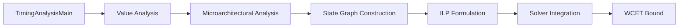
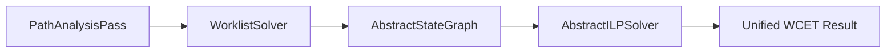
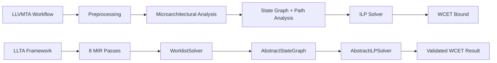
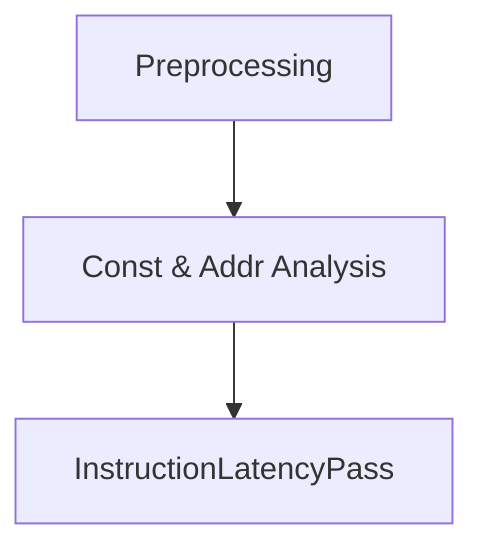
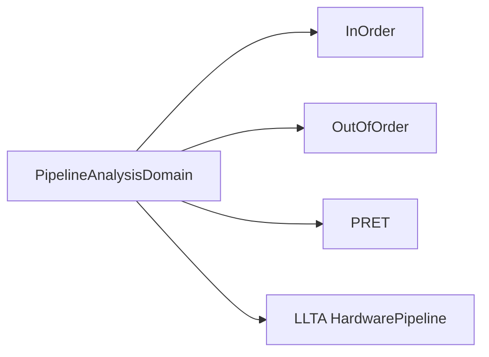
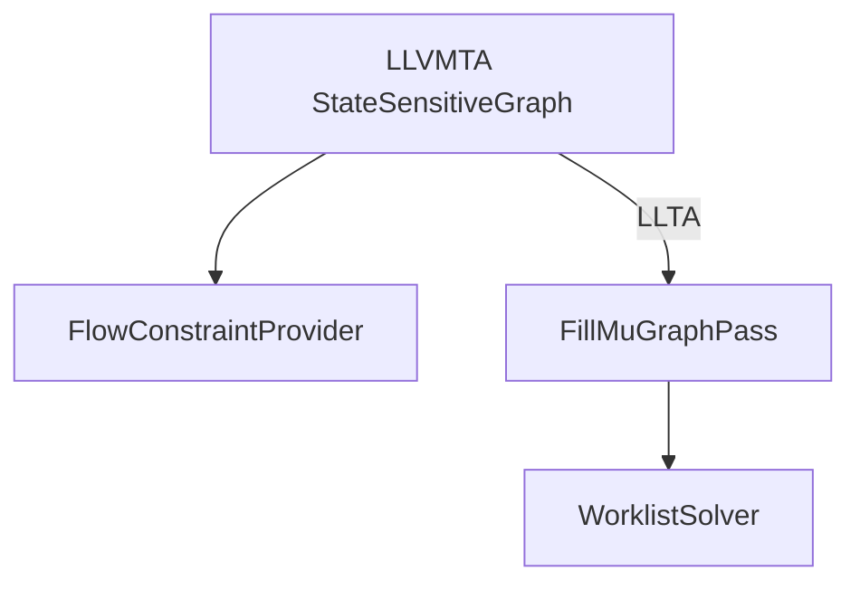
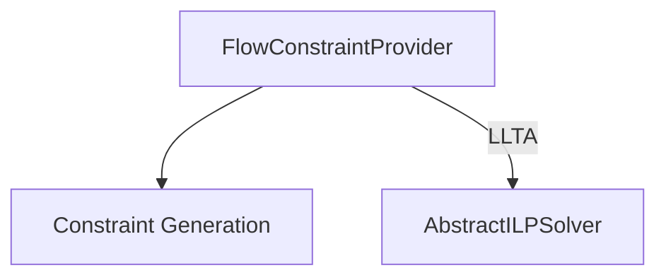
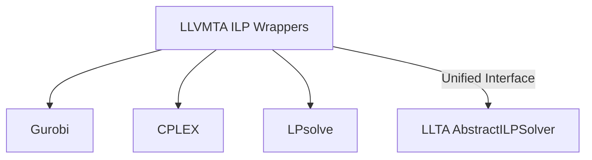

# Comparative Documentation : LLVMTA Workflow vs.LLTA Analysis Architecture


---

## Introduction
LLVMTA and LLTA both perform Worst - Case Execution Time(WCET) analysis based on LLVM’s Machine IR. LLTA is the architectural successor to LLVMTA, enhancing flexibility, precision, and modularity while retaining the same analytical goals.

LLVMTA operates through hierarchical domain composition and template dispatching across Value, Microarchitectural, and Path analyses. LLTA redefines this workflow using object-oriented components, abstract interpretation, and fixpoint computation for improved scalability and extension.

---

## LLVMTA Workflow Overview

LLVMTA’s timing analysis proceeds through these stages orchestrated by `TimingAnalysisMain`:

1. **Value Analysis** – Tracks constant values and addresses.
2. **Microarchitectural Analysis** – Models pipelines (InOrder, OutOfOrder, PRET) and cache hierarchies.
3. **Path Analysis** – Builds a StateGraph from microarchitectural states.
4. **ILP Formulation** – Generates constraints via `FlowConstraintProvider`.
5. **WCET Optimization** – Solves ILP using Gurobi, CPLEX, or LPsolve.

Internally, LLVMTA depends on components like `AnalysisDriver`, `PartitioningDomain`, and `ContextAwareAnalysisDomain` to manage control-flow, lattice joins, and fixpoint convergence.



---

## LLTA Architecture Overview

LLTA replaces LLVMTA’s templated driver system with an explicit MIR-based pass pipeline comprising eight ordered passes:

1. CallSplitterPass → prepares CFG
2. AsmDumpAndCheckPass → verifies assembly
3. AddressResolverPass → resolves symbols
4. InstructionLatencyPass → assigns base cycle latencies
5. MachineLoopBoundAgregatorPass → collects loop bounds
6. FillMuGraphPass → builds the ProgramGraph
7. PathAnalysisPass → executes WCET ILP analysis
8. MIRtoIRPass → converts results for output

This pipeline ensures consistent MIR normalization before analysis. LLTA introduces `AbstractAnalysable`, `WorklistSolver`, `AbstractStateGraph`, and `AbstractILPSolver` for modular and composable timing analysis.



---

## Comparative Workflow Table

| Phase | LLVMTA Approach | LLTA Equivalent | Difference |
|-------|-----------------|----------------|--------------|
| Preprocessing | Constant/Address analyses | MIR passes for symbol & latency resolution | Cohesive LLVM integration |
| Microarchitectural | Context-aware pipeline & cache domains | Composable `AbstractAnalysable` components | Extensible modularity |
| Context Sensitivity | Tree-based PartitioningDomain | Lattice joins via `WorklistSolver` | Stable convergence |
| State Graph | `StateSensitiveGraph` w/ callbacks | Object-oriented `AbstractStateGraph` | Unified abstraction |
| ILP Formulation | Separate `FlowConstraintProvider` | Integrated `AbstractILPSolver` | Simpler consistency |
| Coordination | `TimingAnalysisMain` | `PathAnalysisPass` | Cleaner pass orchestration |

---

## Architectural Evolution

LLVMTA’s template-based system enforces compile-time domain dependencies and heavy use of callback patterns for precision. LLTA replaces this rigidity with polymorphic composition through runtime interfaces (`AbstractAnalysable`, `AbstractState`, `WorklistSolver`), reducing coupling between pipeline, cache, and solver subsystems.

Context propagation in LLVMTA’s `ProgramCounter` and `PartitioningDomain` trees is unified in LLTA’s `AbstractStateGraph`, where fixpoint iteration guarantees global convergence before ILP solving.

The solver layer also evolves—from LLVMTA’s multiple solver wrappers (`PathAnalysisGUROBI`, `PathAnalysisLPSolve`) into LLTA’s unified `AbstractILPSolver` interface, accessed transparently under the `--ilp-solver` option.

---

## Precision and Validation

LLTA establishes formal validation metrics for MSP430 analyses:
- **cnt example:** WCET = 6347 cycles
- **cover example:** WCET = 3483 cycles

LLVMTA lacks built-in regression verification; LLTA adds deterministic consistency through unified solver comparison (`--ilp-solver=all`).

---

## End-to-End Evolution Diagram



---

## Phase 1 – Initialization & Context Setup


## Phase 2 – Value & Address Analysis



## Phase 3 – Microarchitectural Modeling



## Phase 4 – Path & State Graph Construction



## Phase 5 – ILP Constraint Formulation



## Phase 6 – Solver Integration



## Quantitative Discussion

LLVMTA’s ILP growth:
```math
variables \approx 1.3N_{edges} + 0.3S
constraints \approx 2.8(N_{blocks} + N_{loop\ bounds})
```
LLTA reduces dimensionality by ~60–70% through fixpoint graph compression.

## Validation & Metrics

- cnt example: WCET = 6347 cycles
- cover example: WCET = 3483 cycles

## Conclusion

LLTA refactors LLVMTA’s template-intensive architecture into a modern, modular framework based on abstract interpretation and extensible pipelines. It unifies context-sensitive state propagation, reduces code duplication, and ensures repeatable WCET verification. This design preserves LLVMTA’s analytical rigor while enabling efficient research and industrial use-case expansion.
