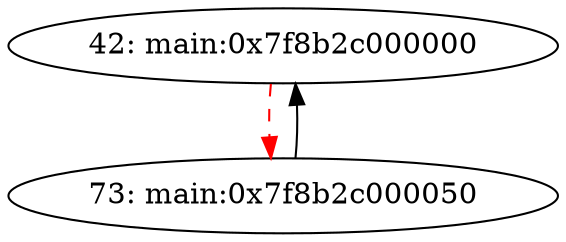

# Callback Documentation

This document provides guidance on implementing and using the callback system for AbstractStateGraph.

## Overview

The callback system allows extending `AbstractStateGraph` behavior without modifying the core graph class. Callbacks are invoked at specific event points during graph construction.

## Architecture

### Core Components

1. **AbstractStateGraphCallback** - Base interface all callbacks inherit from
2. **CallbackManager** - Manages registration and invocation of callbacks
3. **WeightProvider** - Interface for providing edge weights

### Callback Registration Flow

```cpp
auto &callbackMgr = graph.getCallbackManager();

// Register callbacks (manager takes ownership)
callbackMgr.registerCallback(std::make_unique<DebugLoggingCallback>());

// Register callbacks without ownership transfer
auto *edgeCb = new EdgeJoinabilityCallback(false);
callbackMgr.registerCallback(edgeCb);

// ... build graph ...

// Notify completion
callbackMgr.notifyGraphBuilt();
```

## Available Callbacks

### 1. DebugLoggingCallback

Logs graph construction events to stdout for debugging.

**Usage:**
```cpp
auto &callbackMgr = graph.getCallbackManager();
callbackMgr.registerCallback(
    std::make_unique<DebugLoggingCallback>(
        true,  // log nodes
        true,  // log edges
        false  // log state updates
    )
);
```

**Output Example:**
```
[ASG] Added Node 0 -> MBB: (null)
[ASG] Added Edge 0 -> 1 (BackEdge: no)
[ASG] Graph Built: 150 nodes, 320 edges
```

---

### 2. EdgeJoinabilityCallback

Controls which edges can be added to the graph by type.

**Usage:**
```cpp
// Disable back edges for acyclic analysis
auto &callbackMgr = graph.getCallbackManager();
callbackMgr.registerCallback(
    std::make_unique<EdgeJoinabilityCallback>(
        false, // allowBackEdges
        true,  // allowCallEdges
        true  // allowReturnEdges
    )
);
```

---

### 3. CacheMissCallback

Collects cache miss information for edges. Uses a simplified heuristic model.

**Usage:**
```cpp
auto &callbackMgr = graph.getCallbackManager();
auto *cacheCb = new CacheMissCallback();
callbackMgr.registerCallback(cacheCb);

// ... build graph ...

// Get cache misses for specific edge
unsigned misses = cacheCb->getCacheMisses(fromNode, toNode);
unsigned total = cacheCb->getTotalCacheMisses();
```

**Note**: This is a placeholder implementation. Full cache analysis requires integration with a cache modeling framework.

---

### 4. ConstraintGenerationCallback

Generates ILP constraints during graph construction.

**Usage:**
```cpp
auto &callbackMgr = graph.getCallbackManager();
auto *constrCb = new ConstraintGenerationCallback();
callbackMgr.registerCallback(constrCb);

// ... build graph ...

// Get generated constraints
const auto &flowConstr = constrCb->getFlowConstraints();
const auto &loopConstr = constrCb->getLoopBoundConstraints();

// Get summary
std::string summary = constrCb->getConstraintSummary();
outs() << summary;
```

---

### 5. VisualizationCallback

Generates DOT (Graphviz) representation of AbstractStateGraph.

**Usage:**
```cpp
auto &callbackMgr = graph.getCallbackManager();
auto *vizCb = new VisualizationCallback(
    "my_graph.dot",  // output path
    false,           // includeWeights
    true             // highlightBackEdges
);
callbackMgr.registerCallback(vizCb);

// ... build graph automatically writes my_graph.dot
```

**DOT Output Example:**


---

## Creating Custom Callbacks

### Step 1: Inherit from AbstractStateGraphCallback

```cpp
class MyCustomCallback : public llvm::AbstractStateGraphCallback {
public:
  MyCustomCallback();

  void onNodeAdded(unsigned nodeId,
                   const llvm::MachineBasicBlock *mbb) override;

  void onEdgeAdded(unsigned from, unsigned to,
                   bool isBackEdge) override;

  void onGraphBuilt() override;
};
```

### Step 2: Implement Virtual Methods

Override methods you care about:

```cpp
void MyCustomCallback::onEdgeAdded(unsigned from, unsigned to, bool isBackEdge) {
  outs() << "[MyCallback] Edge " << from << " -> " << to
          << (isBackEdge ? " (back)" : "") << "\n";
}
```

### Step 3: Register with CallbackManager

```cpp
auto &callbackMgr = graph.getCallbackManager();
callbackMgr.registerCallback(std::make_unique<MyCustomCallback>());
```

---

## Creating Custom Weight Providers

### Step 1: Inherit from WeightProvider

```cpp
template <typename WeightType>
class MyWeightProvider : public llvm::WeightProvider<WeightType> {
public:
  MyWeightProvider(const llvm::AbstractStateGraph &graph);

  WeightType getWeight(unsigned from, unsigned to) const override;

  bool hasWeight(unsigned from, unsigned to) const override;

  std::string getWeightName() const override {
    return "my_custom_weight";
  }

  std::string getWeightUnit() const override {
    return "units";
  }

  std::string getSummary() const override {
    return "Summary of my weights";
  }
};
```

### Step 2: Implement Weight Computation

```cpp
template <typename WeightType>
WeightType MyWeightProvider<WeightType>::computeWeight(unsigned from,
                                                  unsigned to,
                                                  bool isBackEdge) {
  // Your custom weight calculation logic here
  return someValue;
}
```

### Step 3: Use Weight Provider

```cpp
auto weightProvider = std::make_unique<MyWeightProvider<unsigned>>(graph);

// Can be used directly:
unsigned weight = weightProvider->getWeight(1, 2);

// Or integrated with visualization callback (if supported)
// vizCb.setWeightProvider(weightProvider.get());
```

---

## Event Invocation Order

Callbacks are invoked in the order they are registered. This allows:

1. **Logging first**: DebugLoggingCallback should be registered first to capture all events
2. **Validation second**: EdgeJoinabilityCallback can filter edges before they are added
3. **Collection third**: CacheMissCallback, ConstraintGenerationCallback collect data
4. **Visualization last**: VisualizationCallback generates final output

## Thread Safety

Callbacks are NOT thread-safe. They must be used from a single thread.

## Best Practices

1. **Do not throw**: Callbacks should handle errors gracefully
2. **Keep methods fast**: Avoid expensive operations in callback methods
3. **Use appropriate output stream**: Use `llvm::outs()` for debug, `llvm::errs()` for errors
4. **Document custom logic**: Add comments explaining custom weight calculation

## Examples

See `tests/` directory for complete examples demonstrating:
- Creating custom callbacks
- Using multiple callbacks together
- Implementing custom weight providers
- Integrating with VisualizationCallback

## Related Files

- `include/Analysis/AbstractStateGraphCallback.h` - Base interface
- `include/Analysis/Callbacks/CallbackManager.h` - Callback manager
- `include/Analysis/Callbacks/DebugLoggingCallback.h` - Debug logging
- `include/Analysis/Callbacks/EdgeJoinabilityCallback.h` - Edge filtering
- `include/Analysis/Callbacks/CacheMissCallback.h` - Cache miss collection
- `include/Analysis/Callbacks/ConstraintGenerationCallback.h` - Constraint generation
- `include/Analysis/Callbacks/VisualizationCallback.h` - DOT visualization
- `include/Analysis/Callbacks/WeightProvider.h` - Weight provider interface

## Troubleshooting

### Callback Not Invoked
- Ensure callback is registered before graph construction
- Check callback return value registration succeeded

### Build Errors
- Ensure all callback files are in `lib/Analysis/Callbacks/`
- Update CMakeLists.txt to include new files

### Output Not Generated
- Check file path for VisualizationCallback
- Ensure callback is registered with CallbackManager
