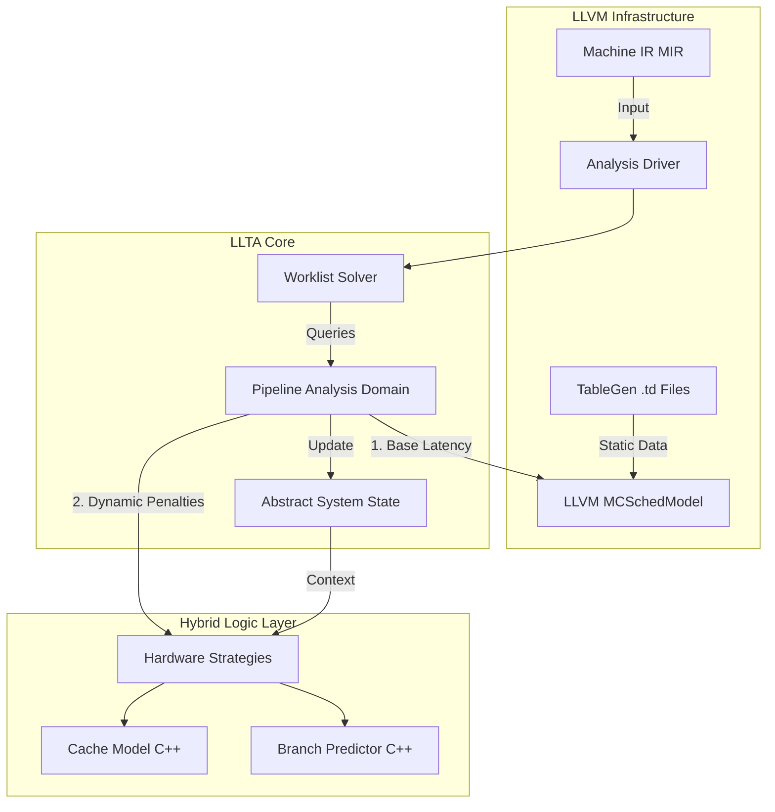

This is a comprehensive architectural blueprint for the **Hybrid LLTA Analysis Engine**. This design balances the robustness of LLVM's existing backend data with the flexibility required for research-grade WCET analysis.

### 1\. The Architecture Diagram

This diagram visualizes the separation between the **Solver** (the engine), the **LLVM Backend** (the static physics), and the **LLTA Plugins** (the dynamic logic).



**Key Data Flow:**

1.  The **Solver** pushes the `AbstractSystemState` through the Control Flow Graph.
2.  The **Pipeline Domain** encounters a `MachineInstr`.
3.  It asks **LLVM SchedModel**: "How long does this take purely based on operands and hazards?" (e.g., 3 cycles).
4.  It asks **Cache Model**: "Is `0x1004` a Hit or Miss?" (e.g., Miss = +10 cycles).
5.  It updates the `AbstractSystemState` with the total time (13 cycles) and the new cache state.

-----

### 2\. Implementation Overview

We will implement this in **four distinct modules** to ensure modularity.

1.  **`LLTASolver`**: A generic, non-templated (or lightly templated) fixpoint engine.
2.  **`LLTAState`**: The container for the analysis results (pipeline resources, cache tags, clock cycle).
3.  **`LLTAStrategies`**: The abstract base classes for Cache, Branch Prediction, and Memory Controllers.
4.  **`LLTADomain`**: The coordinator that ties MIR, Strategies, and State together.

-----

### 3\. The Header Files

Here are the concrete contracts your team needs to implement.

#### A. `include/llta/Analysis/HardwareStrategies.h`

*Defines the interface for dynamic hardware components (Cache, BP).*

```cpp
#ifndef LLTA_ANALYSIS_HARDWARESTRATEGIES_H
#define LLTA_ANALYSIS_HARDWARESTRATEGIES_H

#include "llvm/CodeGen/MachineInstr.h"
#include <cstdint>

namespace llta {

/// Abstract base class for Branch Prediction logic.
class BranchPredictorStrategy {
public:
  virtual ~BranchPredictorStrategy() = default;

  enum PredictionResult {
    Correct,
    Mispredicted,
    Unknown
  };

  /// Returns the prediction result for a specific branch instruction
  /// given the current global history (if modeled).
  virtual PredictionResult predict(const llvm::MachineInstr &MI) = 0;

  /// Updates the internal state of the predictor (e.g., History Register).
  virtual void update(const llvm::MachineInstr &MI, bool Taken) = 0;
};

/// Abstract base class for Cache hierarchies.
class CacheStrategy {
public:
  virtual ~CacheStrategy() = default;

  enum AccessResult {
    Hit,
    Miss,
    Unknown
  };

  /// Models a memory access to a specific abstract address.
  /// Returns Hit/Miss to calculate latency penalties.
  virtual AccessResult access(uint64_t AbstractAddress, bool IsWrite) = 0;
};

} // namespace llta

#endif // LLTA_ANALYSIS_HARDWARESTRATEGIES_H
```

#### B. `include/llta/Analysis/SystemState.h`

*Defines the "Lattice" element that flows through the graph.*

```cpp
#ifndef LLTA_ANALYSIS_SYSTEMSTATE_H
#define LLTA_ANALYSIS_SYSTEMSTATE_H

#include "llvm/ADT/SmallVector.h"
#include <map>

namespace llta {

/// Represents the instantaneous snapshot of the hardware.
class SystemState {
public:
  /// The current Worst-Case Execution Time in cycles up to this point.
  uint64_t CycleCount = 0;

  /// Tracks when specific hardware resources (ALUs, Ports) become free.
  /// Key: ResourceID (from LLVM MCSchedModel), Value: Cycle available.
  std::map<unsigned, uint64_t> ResourceAvailability;

  /// Note: Real implementation might include CacheState/HistoryRegister here.
  /// Ideally, use a PImpl idiom or pointer to a State structure to keep this lightweight.

  bool operator==(const SystemState &Other) const {
    return CycleCount == Other.CycleCount && 
           ResourceAvailability == Other.ResourceAvailability;
  }

  bool operator!=(const SystemState &Other) const { return !(*this == Other); }

  /// The Join operator (Lattice Union).
  /// Merges state from predecessor blocks (e.g., takes max CycleCount).
  void join(const SystemState &Other);
  
  /// Helper to advance time (pipeline stall or instruction execution).
  void advanceClock(uint64_t Cycles);
};

} // namespace llta

#endif
```

#### C. `include/llta/Analysis/PipelineAnalysis.h`

*The Core Domain Logic.*

```cpp
#ifndef LLTA_ANALYSIS_PIPELINEANALYSIS_H
#define LLTA_ANALYSIS_PIPELINEANALYSIS_H

#include "llta/Analysis/SystemState.h"
#include "llta/Analysis/HardwareStrategies.h"
#include "llvm/CodeGen/TargetSchedule.h"
#include "llvm/CodeGen/MachineFunction.h"

namespace llta {

class PipelineAnalysis {
  llvm::TargetSchedModel SchedModel;
  
  // Owned strategies (populated via factory or config)
  std::unique_ptr<CacheStrategy> ICache;
  std::unique_ptr<BranchPredictorStrategy> BPredictor;

public:
  PipelineAnalysis(const llvm::TargetSubtargetInfo &STI);

  SystemState getEntryState() const;
  SystemState getBottomState() const;

  /// The main Transfer Function.
  /// Computes State_Out = f(State_In, Instruction)
  SystemState transfer(const llvm::MachineInstr &MI, SystemState InState);

private:
  /// Queries LLVM SchedModel for structural hazards and basic latency.
  unsigned computeBaseLatency(const llvm::MachineInstr &MI, SystemState &State);
  
  /// Queries strategies for dynamic penalties (Cache Miss, Branch Flush).
  unsigned computeDynamicPenalties(const llvm::MachineInstr &MI);
};

} // namespace llta

#endif
```

#### D. `include/llta/Solver/WorklistSolver.h`

*The simplified, reusable solver.*

```cpp
#ifndef LLTA_SOLVER_WORKLISTSOLVER_H
#define LLTA_SOLVER_WORKLISTSOLVER_H

#include "llvm/CodeGen/MachineBasicBlock.h"
#include "llvm/ADT/DenseMap.h"
#include "llvm/ADT/SmallVector.h"

namespace llta {

template <typename AnalysisDomain>
class WorklistSolver {
  AnalysisDomain &Domain;
  using StateType = typename AnalysisDomain::StateType; // Expected from Domain

  llvm::DenseMap<const llvm::MachineBasicBlock *, StateType> BlockStates;
  llvm::SmallVector<llvm::MachineBasicBlock *, 32> Worklist;

public:
  WorklistSolver(AnalysisDomain &D) : Domain(D) {}

  void solve(llvm::MachineFunction &MF);
};

// Implementation included in header for templates
template <typename AnalysisDomain>
void WorklistSolver<AnalysisDomain>::solve(llvm::MachineFunction &MF) {
    // ... (Standard worklist algorithm as discussed previously) ...
}

} // namespace llta

#endif
```

-----

### 4. The Execution Plan (ToDo List + AI Prompts)

Use these prompts with your AI coding assistant to generate the `.cpp` files and fill in the logic.

- [ ] **Step 1: The Solver Infrastructure**
    - **Target:** `lib/Analysis/WorklistSolver.cpp`
    - **Context:** `.ai/style.md`, `.ai/architecture.md`, `include/llta/Solver/WorklistSolver.h`
    - **AI Prompt:**
      > **System:** Act as a Senior Compiler Engineer.
      > **Task:** Implement the `solve` method for the `WorklistSolver` class in `WorklistSolver.cpp`.
      > **Instructions:**
      > 1. Read and internalize the coding standards defined in `.ai/style.md`.
      > 2. Read and internalize the architectural constraints in `.ai/architecture.md`, specifically the section on "Solver Design" and avoiding template overuse.
      > 3. Using the interfaces defined in `include/llta/Solver/WorklistSolver.h`, implement a standard worklist algorithm.
      > 4. Adhere strictly to the data structure usage (`DenseMap`/`SmallVector`) mandated by the architecture guide.
      > 5. Ensure the solution is modular and does not introduce new template parameters beyond what is defined in the header.

- [ ] **Step 2: The System State (Lattice)**
    - **Target:** `lib/Analysis/SystemState.cpp`
    - **Context:** `.ai/style.md`, `.ai/architecture.md`, `include/llta/Analysis/SystemState.h`
    - **AI Prompt:**
      > **System:** Act as a Senior Systems Programmer.
      > **Task:** Implement the `join` and `advanceClock` methods for `SystemState` in `lib/Analysis/SystemState.cpp`.
      > **Instructions:**
      > 1. Apply the formatting rules from `.ai/style.md` (pay attention to const-correctness and naming).
      > 2. Review the WCET Logic guidelines in `.ai/architecture.md` regarding "Safe Upper Bounds".
      > 3. Implement `join` using the "Max" operator for cycles (conservative worst-case) as described in the architecture docs.
      > 4. Implement `advanceClock` to strictly increment the global counter.

- [ ] **Step 3: The Pipeline Physics**
    - **Target:** `lib/Analysis/PipelineAnalysis.cpp`
    - **Context:** `.ai/style.md`, `.ai/architecture.md`, `include/llta/Analysis/PipelineAnalysis.h`
    - **AI Prompt:**
      > **System:** Act as an LLVM Backend Developer.
      > **Task:** Implement `PipelineAnalysis::computeBaseLatency`.
      > **Instructions:**
      > 1. Load `.ai/architecture.md` to understand the "Hybrid Analysis" approach (Static .td + Dynamic C++).
      > 2. Follow `.ai/style.md` for LLVM API usage.
      > 3. Use `llvm::TargetSchedModel` as the primary source of truth, as specified in the "Static Data" section. Do not hardcode latencies.
      > 4. Ensure the implementation aligns with the `PipelineAnalysis.h` header.

- [ ] **Step 4: The Strategies (Hybrid Plugins)**
    - **Target:** `lib/Analysis/HardwareStrategies.cpp`
    - **Context:** `.ai/style.md`, `.ai/architecture.md`, `include/llta/Analysis/HardwareStrategies.h`
    - **AI Prompt:**
      > **System:** Act as a Software Architect.
      > **Task:** Implement the `LRUCache` and `AlwaysMissCache` strategies.
      > **Instructions:**
      > 1. Refer to the "Plugin System" section in `.ai/architecture.md`.
      > 2. Refer to `.ai/style.md` for inheritance and virtual method best practices.
      > 3. Implement the virtual methods defined in `include/llta/Analysis/HardwareStrategies.h`.
      > 4. The `LRUCache` must implement valid Set-Associative logic using standard STL containers as permitted by the style guide.
      > 5. Keep the implementation decoupled from the core solver.

- [ ] **Step 5: The Driver (Pass Entry)**
    - **Target:** `lib/Passes/LLTAPass.cpp`
    - **Context:** `.ai/style.md`, `.ai/planning.md`
    - **AI Prompt:**
      > **System:** Act as an LLVM Pass Developer.
      > **Task:** Implement the `runOnMachineFunction` entry point.
      > **Instructions:**
      > 1. Check `.ai/planning.md` for the standard Pass Pipeline registration flow.
      > 2. STRICTLY follow `.ai/style.md` regarding `llvm::errs()` vs `dbgs()` usage.
      > 3. Wire together the `WorklistSolver` and `PipelineAnalysis` components.
      > 4. Ensure the pass is registered as a `MachineFunctionPass`.
      > 5. Output the result as defined in the project's success criteria.
### Next Step for User

Start by creating the folder structure `include/llta/Analysis` and `include/llta/Solver`. Copy the header files above. Then, run the **Step 1** prompt to generate your solver core.\

